> 前言：由於以往，客戶如果填寫google表單後，會使用「LINE Notify」連結並在LINE上做通知。
> 但現在LINE Notify功能在2025/04起就停用了，在網路上尋覓替代方案，找到LINE Message API。
> LINE Message API有免費使用限制，**每個月200則訊息**，但對小用量的使用者來說，應該是夠用（每天約6則訊息）
> 現在就跟大家分享，我是如何進行設置的。

#### 大綱

* 建立LINE Bot與申請Message API
* 創立Google Form與寫自動化提示Google Apps Script
* 表單與設置結果測試

那我們就開始吧！

## Step 1. 建立LINE Bot與申請Message API

### LINE Developers內的操作與建置

首先，進入 [LINE Developers](https://developers.line.biz/en/) 申請自己的帳號，並登入進去。
可以使用自己的LINE帳號，或者是從新建立一個獨立的LINE帳號。我是使用自己的。

並進入後台介面，請點選下圖的「Console」進入控制後台。


接著，點擊「Providers」旁邊的「Create」按鈕，建立一個新的Provider，並取名：
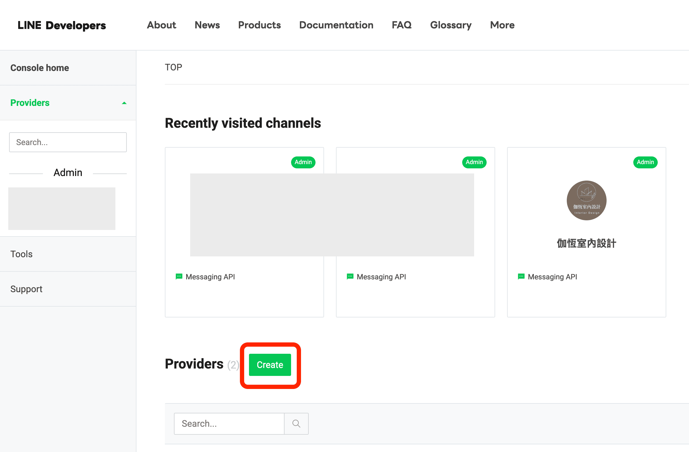


點選中間的「Create a Messaging API channel」> 「Create a LINE Official Account」建立一個新的LINE Bot帳號
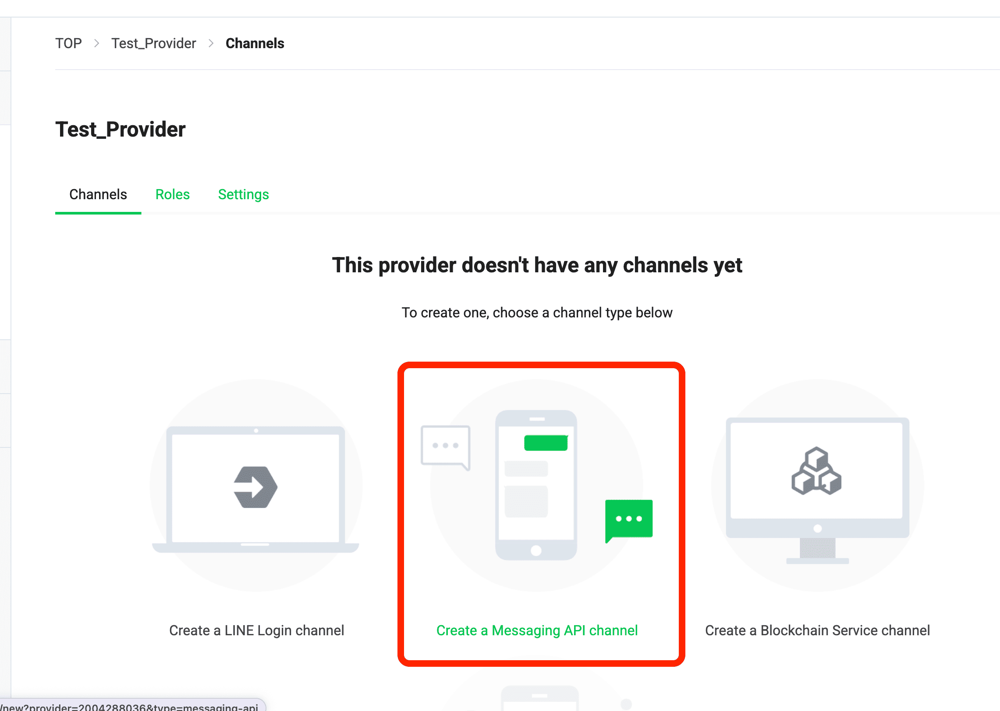
> 備註：這邊會建立一個新的LINE Bot，用來通知的機器人，未來是可以把這個機器人加入群組內。

填寫基本的LINE官方註冊資料，即可完成註冊，按下「稍後進行認證」進入到管理畫面。


### LINE Bot Message API啟用

辦好LINE官方機器人之後，我們要啟用Message API。
步驟：「設定」 > 「Message API」 > 按鈕「啟用Message API」


選擇剛剛在LINE Developers中建立的Provider名稱，點擊「同意」
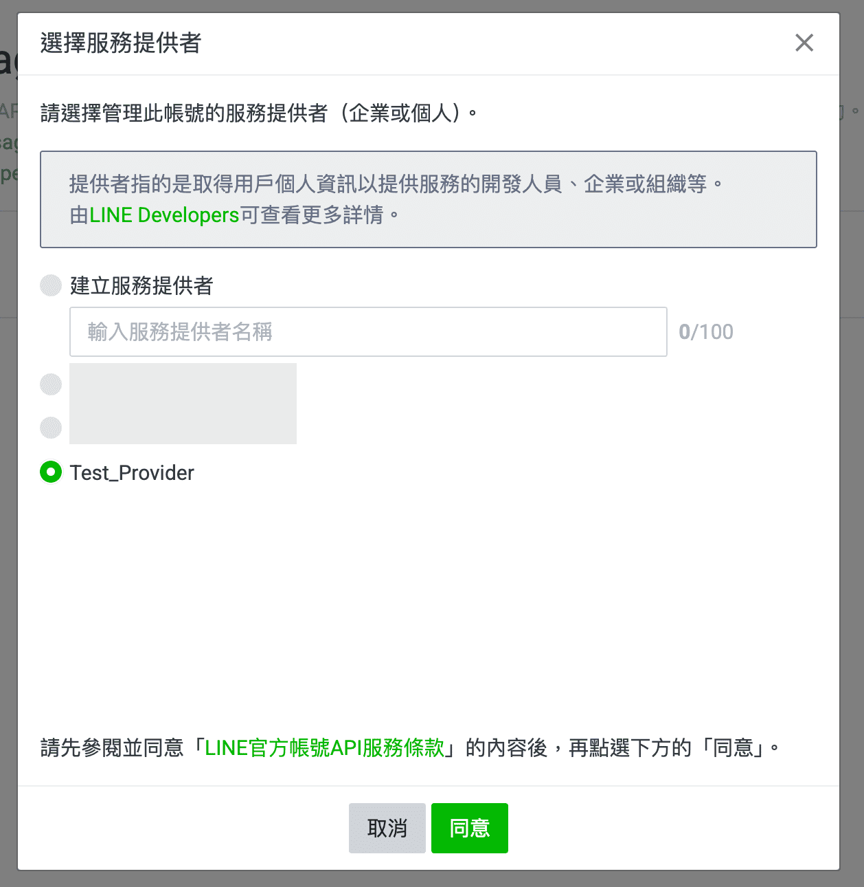
會出現「隱私權政策及服務條款」，可以不用進行填寫，直接「確定」，即可啟用Message API囉！

### LINE Bot 機器人細節設定

LINE Bot這個官方帳號，可以進行一些實用的客制化設定，如下：

* **讓機器人可以允許加入群組或聊天室**

設定>帳號設定>功能切換>加入群組或多人聊天室>選擇「接受邀請加入群組或多人聊天室」


* **關閉回應功能（歡迎訊息、自動回應）**

設定>回應設定>回應功能>關閉「加入好友的歡迎訊息」＆關閉「自動回應訊息」

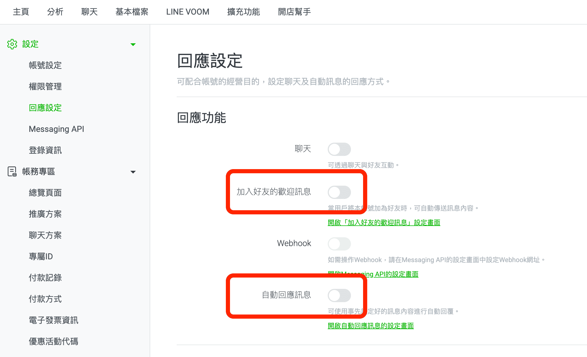

### 兩個關鍵的LINE Developer Token - User ID & Access Token

> 這兩個關鍵的Token很重要，不能夠外流！不然，人家拿到這兩個東東，會到處玩耍。

* 建立「Channel Access Token」
回到LINE Developer剛剛建立的Provider，點擊「Messaging API」，滑到最下面。
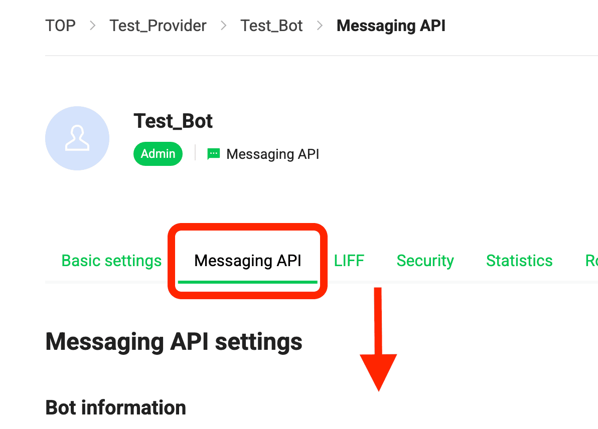

最下面可以看到「**Channel access token**」，點擊「Issue」產生出我們需要的TOKEN本人：
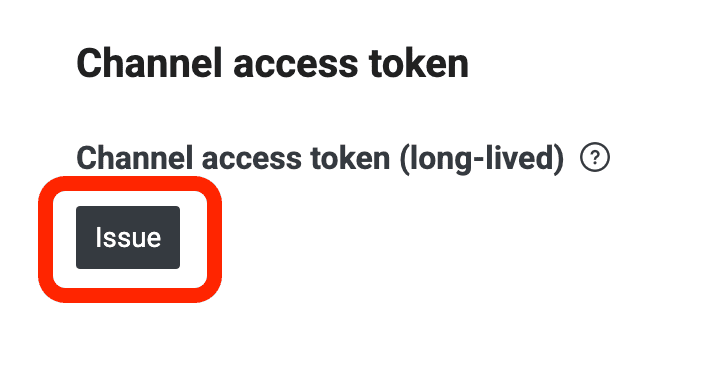
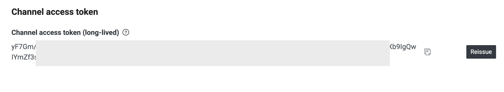
等等會用到這個。

* 找到「Your user ID」
之後，回到最上面，點擊「Basic settings」頁籤，一樣捲到最下面，可以看到「**Your user ID**」字樣一長串的東東，這就是等等我們會用到的第二個token:
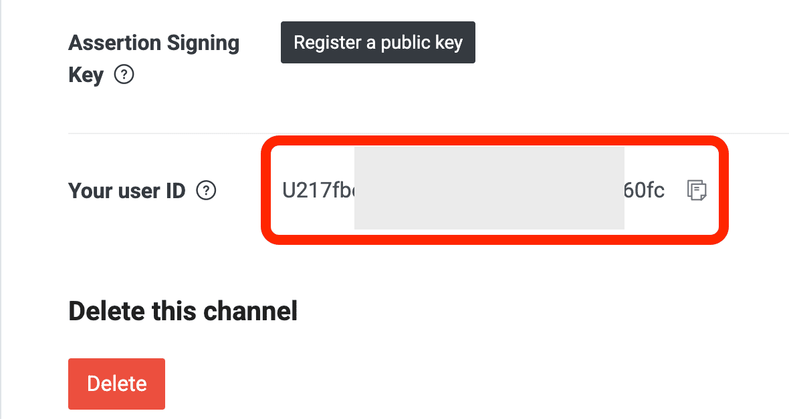

知道這兩個在哪後，我們接著來設定Google Form的部分囉！

## Step 2. 創立Google Form與寫自動化提示Google Apps Script

在Google Drive中，建立你的表單（或者選擇你既有的表單），建立一些題目。
接著，按下三個點 >「Apps Scripts」，如圖所示：
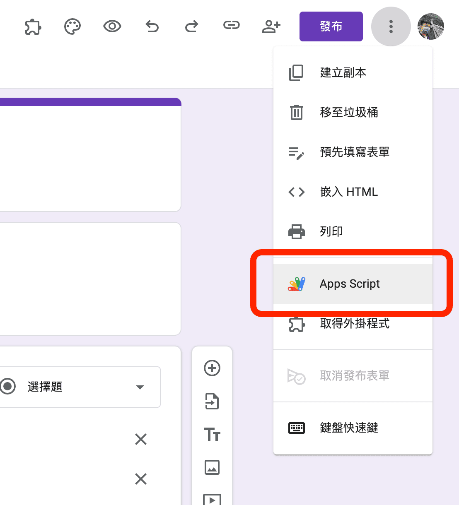

> 有時候登入時，會出現登入次數過多的錯誤訊息，可以嘗試清除快取與Cookie，再重新登入試試看

進入到類似程式碼編輯器的畫面（其實他就是一個編輯器），如下圖：
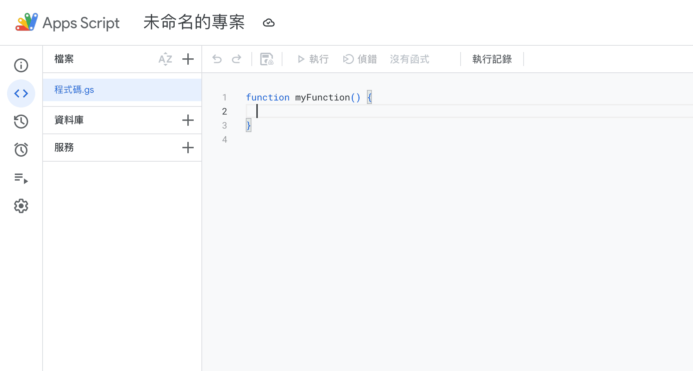

在程式碼畫面中，貼上以下的程式碼：

```ts
// 設定LINE Messaging API的Channel Access Token：這裡填入您的Channel Access Token
const channelAccessToken = '<SET YOUR ACCESS TOKEN>';
// 這裡填入您要收到訊息的用戶LINE user ID，要從LINE Developers管理者頁面取得，不是用戶自己創的ID。
const userId = '<SET YOUR USER ID>';

// trigger:Google表單提送觸發通知
function onFormSubmit(data) {

  // 這裡填入您要顯示的LINE訊息，\n是換行的標記。
  let msg = '** 新的諮詢單來囉！\n'; 
 
  try {
        var formResponses = data.response.getItemResponses();
        for (var i = 0; i < formResponses.length; i++) {
            //取得問卷題目
            var item = formResponses[i].getItem().getTitle();
            //取得問卷答案
            var response = formResponses[i].getResponse();
            //將答案填入訊息中
            msg += item + " ： " + response + "\n\n";
        }
    } catch (err) {
        //測試 Token 可用
        msg += "No Answers for message.\n\n"
        //異常時進行紀錄
        Logger.log(err)
    }

  // 發送LINE訊息
  sendMessage(channelAccessToken, msg);
}

// 發送LINE訊息
function sendMessage(channelAccessToken, msg) {

  let message = {
    "to": userId,
    "messages": [
      {
        "type": "text",
        "text": msg
      }
    ]
  };

  // 設定 HTTP 請求選項
  let options = {
    "method": "post",
    "contentType": "application/json",
    "headers": {
      "Authorization": "Bearer " + channelAccessToken
    },
    "payload": JSON.stringify(message)
  };

  // 發送 POST 請求到 LINE API
  let response = UrlFetchApp.fetch("https://api.line.me/v2/bot/message/push", options);
  
  // 輸出結果（檢查回應）
  Logger.log(response.getContentText());

  console.log(`發送LINE通知~`);
}
```

記得也可以改一下，這個程式的標題喔！

在下圖中，依序貼上那「兩個關鍵的LINE Developer Token」，在畫面中有他們該出現的位置：
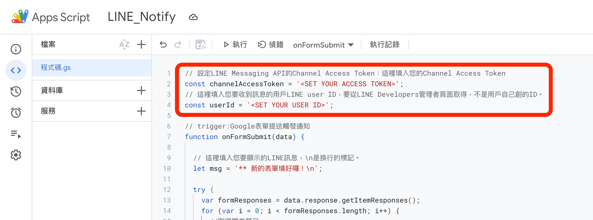

接著，可以按下「Ctrl+S」or「Command+S」，或者下面圖片的「小磁碟」圖案，來儲存程式碼檔案：
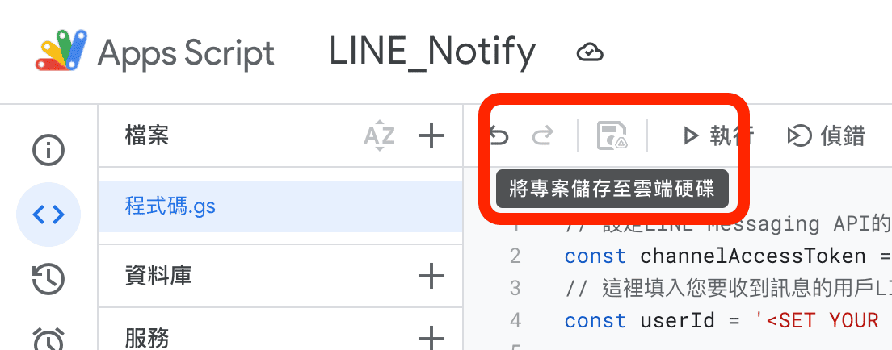

### 設定觸發條件

從左側邊欄位中，選擇「觸發條件」後，按下右下角的「+ 新增觸發按鈕」新增一個觸發事件：
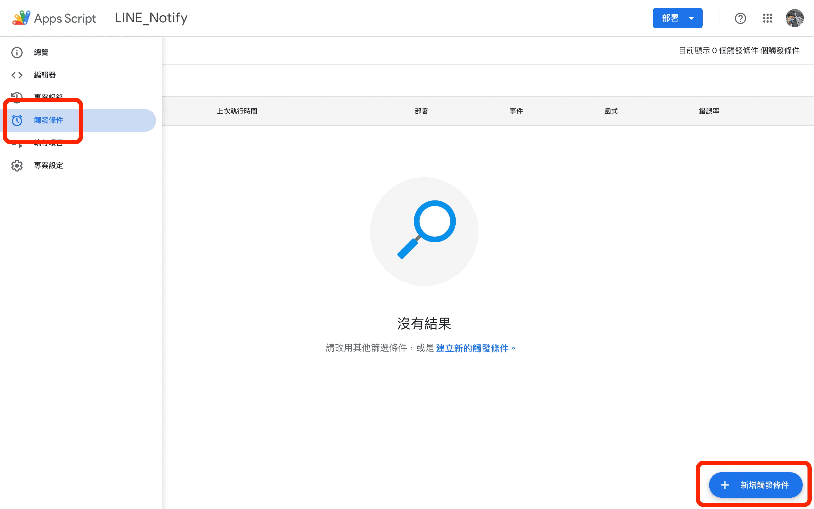

請依照下面圖中的設定，將**執行的功能**設定為「onFormSubmit」;另外，將**活動類型**設定為「提交表單時」，按下儲存。

* 這樣設定的結果，會在使用者提交表單時，會進行LINE Bot通知

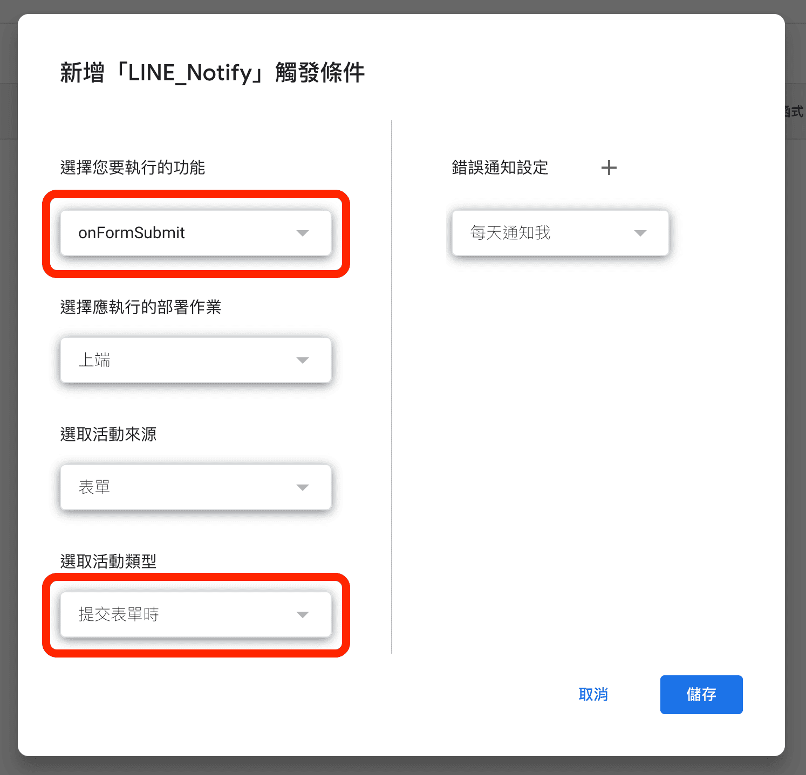

### 開放權限

開放這個自動化App的權限設定：


設定完後，就會出現在畫面中囉！


## Step 3. 表單與設置結果測試

回到自己建立的表單畫面，按下「發佈」取得連結：


現在，可以填寫這份Google表單，填寫完成後，就會看到LINE Bot的訊息通知囉！
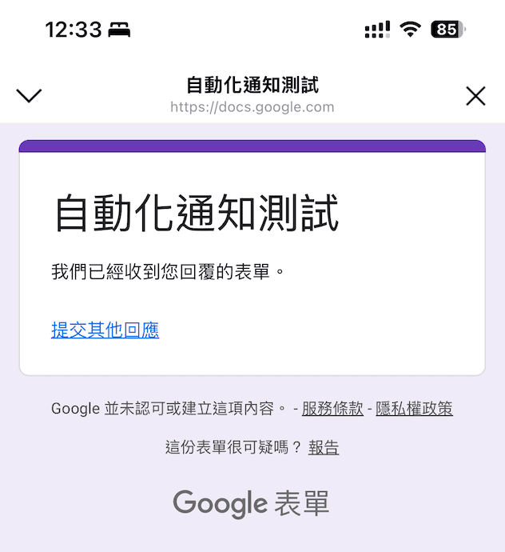
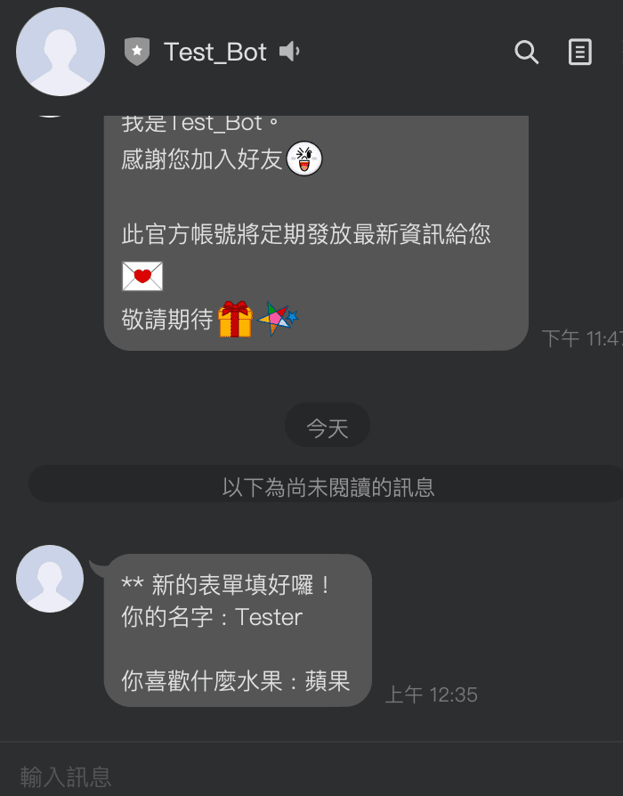
可喜可賀！可喜可賀！

在表單的Apps Scripts中的執行項目，也可以觀察到訊息紀錄，可以用來Debug:
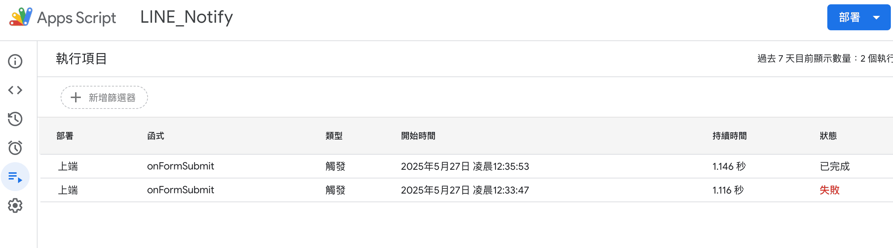

## 小結論

截了一大堆圖片，哈哈。覺得這樣的流程是必須紀錄下來的，非常實用，但確實有些複雜。
程式碼可以依照自己的需求進行客製化調整。希望對大家有幫助。

## Reference

> 感謝以下的參考連結，受益良多，我也是從這些連結學得這個技能的！

* [主題 Google自動化：表單收到回應LINE通知(Messaging API版)](https://home.gamer.com.tw/artwork.php?sn=6059401)
* [2小時初學LINE Bot-Messaging API](https://youtu.be/Mw3cODdkaFM?si=TUDUYIXLzJm66aJv)
